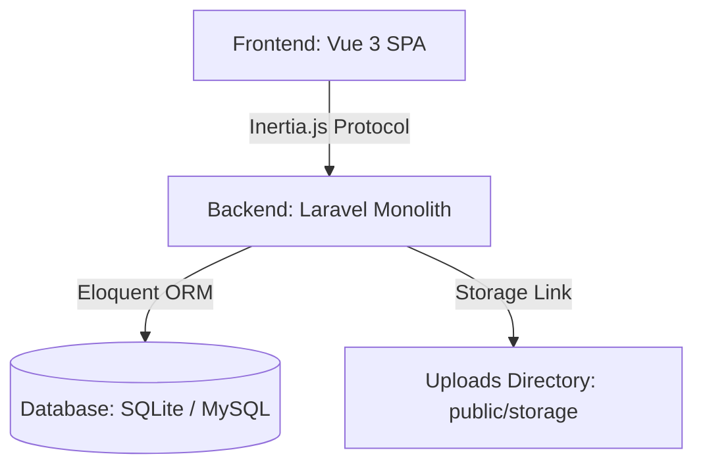
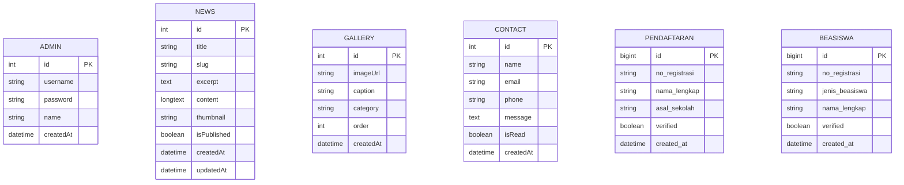

# Panduan Arsitektur & Spesifikasi Sistem Web Al-Hikmah

Dokumen ini menjelaskan secara rinci tentang arsitektur sistem, struktur folder, tumpukan teknologi (tech stack), dependensi library, skema database, serta mekanisme performa dan deployment aplikasi web **Al-Hikmah**.

---

## 1. Ikhtisar Sistem (System Overview)

Sistem web Al-Hikmah menggunakan arsitektur **Client-Server** yang terpisah namun dikemas dalam satu repositori (*monorepo-style*) untuk kemudahan manajemen dan deployment.



*   **Frontend (Client):** Menggunakan **Vue 3** (Composition API) dengan **Vite** sebagai *bundler*. Frontend dirancang sebagai *Single Page Application* (SPA) dengan performa tinggi, pemuatan cepat, dan ramah seluler (*mobile-first*).
*   **Backend (Server):** Berbasis **Node.js** menggunakan framework **Express**. Menyediakan API RESTful untuk pendaftaran, manajemen berita, galeri kegiatan, fasilitas, dan autentikasi admin.
*   **Database:** Menggunakan **MySQL** untuk penyimpanan persisten. Skema dan sinkronisasi dikelola dengan **Prisma ORM**, sedangkan eksekusi query harian menggunakan **`mysql2/promise`** pool untuk kecepatan dan efisiensi maksimum.

---

## 2. Struktur Folder & Repositori

```text
al-hikmah/
├── backend/                  # Kode sumber server backend
│   ├── prisma/               # Skema database & seeder (Prisma)
│   │   ├── schema.prisma
│   │   └── seed.js
│   ├── src/                  # Kode aplikasi backend
│   │   ├── db.js             # Konfigurasi mysql2 Connection Pool
│   │   ├── index.js          # Entry point utama aplikasi Express
│   │   ├── middleware/       # Autentikasi JWT & filter request
│   │   └── routes/           # Endpoint API (Berita, Galeri, dll)
│   ├── uploads/              # Penyimpanan lokal untuk media & dokumen
│   ├── package.json          # Dependensi server
│   └── init-cms.js           # Script inisialisasi tabel CMS
├── frontend/                 # Kode sumber client frontend
│   ├── src/
│   │   ├── assets/           # Gambar, logo statis, dan style
│   │   ├── components/       # Komponen Vue reusable & Section
│   │   ├── router/           # Routing SPA (Vue Router)
│   │   ├── store/            # State Management (Pinia)
│   │   ├── views/            # Halaman utama & Dashboard Admin
│   │   └── App.vue           # Root Component
│   ├── index.html            # Main HTML template
│   ├── vite.config.js        # Konfigurasi bundler Vite
│   └── package.json          # Dependensi client
├── server.js                 # Entry point Hostinger Startup
└── package.json              # Script manajemen monorepo
```

---

## 3. Tumpukan Teknologi & Dependensi

### 3.1 Frontend (Client)
Frontend menggunakan teknologi Vue 3 modern dengan ekosistem yang dioptimalkan untuk meminimalkan beban bundle utama (*main bundle weight*).

| Nama Library | Versi | Kegunaan |
| :--- | :--- | :--- |
| **Vue** | `^3.5.32` | Kerangka kerja utama (Composition API) |
| **Vite** | `^6.0.0` | Build tool & Development server berkecepatan tinggi |
| **Vue Router** | `^4.6.4` | Routing SPA untuk navigasi antarhalaman tanpa reload |
| **Pinia** | `^3.0.4` | State management ringkas untuk sesi & status global |
| **Tailwind CSS** | `^4.2.4` | Desain antarmuka responsif dan estetik |
| **Axios** | `^1.16.0` | HTTP Client untuk integrasi API backend |
| **Swiper** | `^12.1.4` | Slider responsif untuk galeri, program, dan fasilitas |
| **Vue i18n** | `^9.14.5` | Lokalisasi bahasa (Indonesia & English) |
| **AOS** | `^2.3.4` | Animasi halus saat scroll (*Animate On Scroll*) |
| **Lucide Vue Next** | `^1.0.0` | Library icon modern berformat SVG yang fleksibel |

### 3.2 Backend (Server)
Backend dirancang seringkas mungkin menggunakan native Node.js libraries untuk menghemat memori *shared hosting*.

| Nama Library | Versi | Kegunaan |
| :--- | :--- | :--- |
| **Express** | `^4.21.2` | Kerangka kerja HTTP Server & REST API routing |
| **mysql2** | `^3.22.3` | Driver MySQL berkinerja tinggi dengan dukungan async/await |
| **Prisma** | `--` | ORM untuk sinkronisasi struktur tabel dan database |
| **Multer** | `^1.4.5-lts.1` | Middleware untuk menangani upload file (*multipart/form-data*) |
| **BcryptJS** | `^2.4.3` | Hashing aman untuk password administrator |
| **JSONWebToken** | `^9.0.3` | Sesi token aman untuk otorisasi halaman Admin |
| **Sharp** | `^0.34.5` | Kompresi dan optimasi gambar dinamis |
| **CORS** | `^2.8.6` | Middleware pengatur kebijakan keamanan akses asal domain |
| **Dotenv** | `^17.4.2` | Pengelola variabel lingkungan (.env) |

---

## 4. Skema Database (Database Schemas)

Sistem menggunakan Prisma schema untuk sinkronisasi MySQL database. Berikut adalah detail model data:

### 4.1 Tabel Utama Aplikasi



### 4.2 Tabel CMS Landing Page (Dynamic Content)
Untuk memfasilitasi pengeditan konten langsung dari sisi admin tanpa menyentuh kode program:

*   **Tabel `Settings`:**
    *   `id` (INT, Primary Key, Auto Increment)
    *   `key` (VARCHAR, Unique) — Contoh: `about_title`, `founder_name`, `about_image`.
    *   `value` (TEXT) — Menyimpan nilai konten baik berupa teks maupun tautan gambar.
    *   `group` (VARCHAR) — Kategori pengaturan (contoh: `about`, `hero`, `contact`).
*   **Tabel `Programs`:**
    *   `id` (INT, Primary Key, Auto Increment)
    *   `title` (VARCHAR) — Judul program unggulan.
    *   `category` (VARCHAR) — Kategori (contoh: `Kurikulum`, `Ekstrakurikuler`).
    *   `description` (TEXT) — Deskripsi rinci program.
    *   `imageUrl` (VARCHAR) — Foto pendukung kegiatan.
    *   `order` (INT) — Urutan penampilan di landing page.

---

## 5. Strategi Optimalisasi Performa (Performance Optimization)

Untuk mempertahankan performa optimal khususnya pada perangkat seluler (*mobile-first*), strategi berikut diterapkan secara ketat:

1.  **Vite Vendor Chunking:** Memisahkan library pihak ketiga besar (seperti `swiper`, `axios`, `lucide-vue-next`) dari *main bundle* utama ke dalam file terpisah melalui konfigurasi `rollupOptions` di `vite.config.js`. Ini mempercepat *Initial Page Load*.
2.  **Resource Preloading:** Menambahkan tag `<link rel="preload">` di `index.html` untuk gambar banner utama (LCP) agar langsung dimuat di detik pertama sebelum browser memproses file CSS/JS.
3.  **Native Lazy Loading:** Menambahkan atribut `loading="lazy"` pada semua aset gambar non-LCP (Galeri, Fasilitas, Berita) untuk menghemat kuota internet dan menghemat penggunaan memori.
4.  **Penghapusan GSAP:** Menghilangkan dependensi animasi berat (GSAP/ScrollTrigger) dan menggantikannya dengan transisi native CSS modern serta AOS (*Animate On Scroll*) yang sangat ringan.
5.  **Fast Placeholders:** Mengganti generator placeholder lama (`picsum.photos` yang menggunakan redirect lambat) dengan `placehold.co` yang sangat cepat sebagai fallback jika gambar utama belum di-upload.

---

## 6. Arsitektur Unggah File (File Upload Architecture)

Sistem penanganan berkas (upload) didesain khusus agar tahan terhadap proses redeployment otomatis di *shared hosting* (seperti Hostinger):

*   **Absolute Paths Resolution:** Penentuan folder penyimpanan berkas menggunakan referensi absolut `__dirname` dan `process.env.UPLOAD_PATH` guna menghindari ketidakcocokan jalur relatif saat skrip dimulai dari lokasi berbeda.
*   **Recursive Auto-Creation:** Multer terintegrasi dengan fungsi pengecekan folder `fs.existsSync`. Jika folder `uploads/gallery/` atau `uploads/news/` tidak sengaja terhapus atau belum dibuat, backend akan otomatis membuatnya secara rekursif (`fs.mkdirSync(..., { recursive: true })`) saat menerima request pertama, mencegah error `ENOENT`.
*   **Penyimpanan Persisten:** Mendukung pemetaan ke folder persisten di luar direktori build aplikasi agar data pendaftaran, beasiswa, dan galeri tetap aman meskipun frontend diperbarui berkali-kali.
