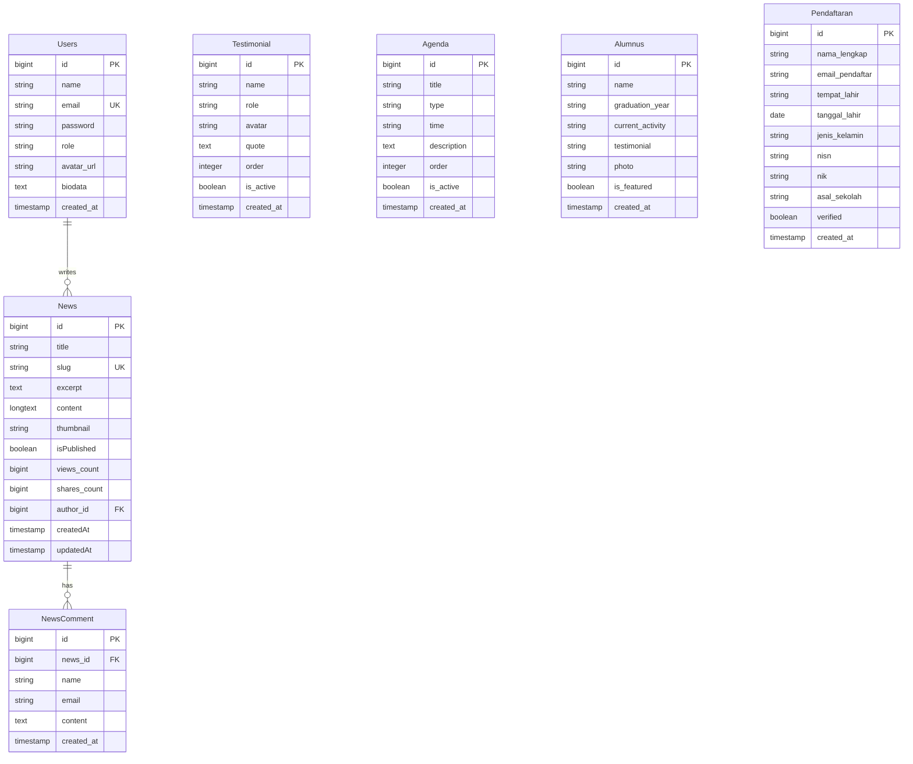

# Pondok Modern Al-Hikmah (Laravel Monolith SPA)

[](https://laravel.com)
[](https://vuejs.org)
[](https://inertiajs.com)
[](https://tailwindcss.com)

Aplikasi web resmi **Pondok Modern Al-Hikmah Utan, Sumbawa** yang dibangun menggunakan arsitektur **Laravel Monolith Modern**. Aplikasi ini menggabungkan ketangguhan backend **Laravel 11** dan kecepatan antarmuka **Vue 3 SPA (Single Page Application)** secara mulus melalui **Inertia.js**, dilengkapi dengan **Filament v3** sebagai sistem manajemen konten (CMS) dinamis.

---

## 1. Wireframe Arsitektur Sistem

Sistem ini berjalan di bawah arsitektur **Monolith Modern**. Aset-aset Vue dikompilasi oleh Vite, lalu dirender langsung melalui route controller Laravel menggunakan Inertia.js untuk pertukaran data asinkron berkecepatan tinggi tanpa reload halaman (*Zero-API boilerplate*).

```mermaid
graph TD
    %% Client-side (Frontend SPA)
    subgraph Client ["Client-Side (Frontend SPA)"]
        Browser["🌐 Web Browser"]
        VueSPA["🟢 Vue 3 SPA (Composition API)"]
        InertiaClient["🟣 Inertia.js Client-Side Link"]
        Tailwind["🎨 Tailwind CSS v4"]
        
        Browser <-->|Interaksi User| VueSPA
        VueSPA <--> InertiaClient
        VueSPA --- Tailwind
    end

    %% Network / Protocol
    InertiaClient <-->|⚡ AJAX / JSON Protocol (Tanpa Reload)| InertiaServer

    %% Server-side (Backend Laravel Monolith)
    subgraph Server ["Server-Side (Backend Monolith)"]
        InertiaServer["🟣 Inertia.js Server-Side Middleware"]
        LaravelControllers["⚙️ Laravel Controllers"]
        FilamentCMS["🛠️ Filament v3 Admin CMS"]
        Eloquent["💾 Eloquent ORM (Models)"]
        
        InertiaServer <--> LaravelControllers
        LaravelControllers <--> Eloquent
        FilamentCMS <--> Eloquent
    end

    %% Storage & Database
    subgraph Storage ["Storage & Database"]
        Database[("🗄️ SQLite / MySQL Database")]
        SymlinkStorage["📁 Public Storage Symlink"]
        
        Eloquent <--> Database
        Eloquent <--> SymlinkStorage
    end

    classDef client fill:#e8f8f5,stroke:#1abc9c,stroke-width:2px;
    classDef server fill:#fef9e7,stroke:#f1c40f,stroke-width:2px;
    classDef storage fill:#fbfcfc,stroke:#7f8c8d,stroke-width:2px;
    class Client,Browser,VueSPA,InertiaClient,Tailwind client;
    class Server,InertiaServer,LaravelControllers,FilamentCMS,Eloquent server;
    class Storage,Database,SymlinkStorage storage;
```

---

## 2. Struktur Database (Schema Relational)

Database dikelola menggunakan Laravel Eloquent Migrations dengan relasi yang dinormalisasi untuk menjaga integritas data.



### Penjelasan Tabel Utama
1. **`Users`**: Menyimpan kredensial administrator CMS (Filament) serta data profil admin.
2. **`News`**: Menyimpan artikel berita, informasi terbaru, dan pengumuman pondok pesantren.
3. **`NewsComment`**: Menampung ulasan/komentar dari pengunjung umum pada tiap artikel berita.
4. **`Testimonial`**: Konten dinamis berisi ulasan wali santri, tokoh masyarakat, dan tokoh agama.
5. **`Agenda`**: Menyimpan jadwal kegiatan santri (Harian, Mingguan, Bulanan, Tahunan).
6. **`Pendaftaran`**: Menyimpan data formulir Penerimaan Santri Baru (PSB) secara daring.

---

## 3. Struktur Folder Terkini

Aplikasi ini diatur secara rapi dan bersih mengikuti standar konvensi struktur monolit Laravel:

```text
alhikmah-laravel/
├── app/                        # Kode Utama Backend Laravel
│   ├── Filament/               # Konfigurasi Panel, Halaman, & Resource CMS (Filament v3)
│   ├── Http/
│   │   ├── Controllers/        # Controller API & Inertia Page Controllers
│   │   └── Middleware/         # Middleware Otorisasi, Inertia, dsb.
│   └── Models/                 # Model Eloquent (News, Testimonial, Agenda, dll)
├── bootstrap/                  # Inisialisasi & Konfigurasi Cache Kernel Laravel
├── config/                     # Berkas Konfigurasi Framework (App, Database, Session, dll)
├── database/                   # Migrasi Skema Tabel, Seeders, & Database SQLite
│   ├── migrations/             # Skrip Struktur Tabel Database Relasional
│   └── seeders/                # Seeder Data Awal (Konten Dummy Realistis)
├── public/                     # Direktori Akses Publik Web
│   ├── assets/                 # Logo statis, Favicon KMI, dsb.
│   ├── build/                  # Aset Frontend Vue yang Dikompilasi (Vite Manifest)
│   └── storage ──► storage/app/public/  # Symlink Direktori Media Uploads
├── resources/                  # Aset Frontend Utama (Uncompiled)
│   ├── css/                    # Desain Global Tailwind v4
│   ├── js/                     # Kode Sumber Aplikasi Vue 3 SPA
│   │   ├── Pages/              # Komponen Halaman SPA (HomePage, RegistrationPage, dll)
│   │   ├── components/         # Komponen reusable (Navbar, Footer, Swiper Sections)
│   │   ├── i18n/               # Konfigurasi Multi-Bahasa (Indonesia & Inggris)
│   │   └── app.js              # Entry point utama Vue + Inertia
│   └── views/                  # Master Blade Layout (app.blade.php)
├── routes/                     # Penentu Alur Navigasi Routing Web & API
│   ├── api.php                 # Endpoint API Publik Berita & PSB
│   └── web.php                 # Rute Render Halaman Vue via Inertia
├── storage/                    # Penyimpanan Internal (Uploads Dokumen, Logs, Cache)
├── tests/                      # Uji Coba Otomatis (PHPUnit/Pest)
├── package.json                # Dependensi Node.js (Vue, Inertia, Tailwind, Swiper)
├── composer.json               # Dependensi PHP Composer (Laravel, Filament)
└── vite.config.js              # Konfigurasi Pengepakan Aset Vite & Vendor Chunking
```

---

## 4. Panduan Instalasi & Pengembangan Lokal

### Prasyarat
* **PHP** `>= 8.2`
* **Composer**
* **Node.js** & **NPM**

### Langkah 1: Kloning Repositori
```bash
git clone https://github.com/celcious-cyber/alhikmah-laravel.git
cd alhikmah-laravel
```

### Langkah 2: Instal Dependensi
```bash
# Instal dependensi PHP backend
composer install

# Instal dependensi JavaScript frontend
npm install
```

### Langkah 3: Konfigurasi Environment File
Salin file `.env.example` ke `.env`:
```bash
cp .env.example .env
```
*(Sesuaikan driver database Anda di dalam file `.env`. Untuk pengembangan instan, default menggunakan SQLite).*

### Langkah 4: Migrasi & Seed Database
Buat database kosong dan jalankan migrasi beserta data awal:
```bash
# Jalankan migrasi & isi data awal (seeder) secara otomatis
php artisan migrate --seed
```

### Langkah 5: Hubungkan Direktori Media (Symlink)
Hubungkan folder aset media pendaftaran/berita agar dapat diakses dari browser:
```bash
php artisan storage:link
```

### Langkah 6: Jalankan Server Lokal
Jalankan server Laravel dan development server Vite secara bersamaan:

```bash
# Jalankan server backend Laravel (berjalan di http://127.0.0.1:8000)
php artisan serve
```

Di terminal terpisah:
```bash
# Jalankan hot-reload Vite untuk frontend
npm run dev
```

---

## 5. Kompilasi Produksi (Production Build)

Sebelum melakukan deployment ke server hosting, lakukan *bundling* aset frontend agar berjalan optimal dan cepat:

```bash
# Kompilasi aset Vue 3 ke dalam bentuk file statis terkompresi
npm run build
```
Aset yang dikompilasi akan secara otomatis ditempatkan pada folder `public/build/` dan siap disajikan langsung oleh web server.
